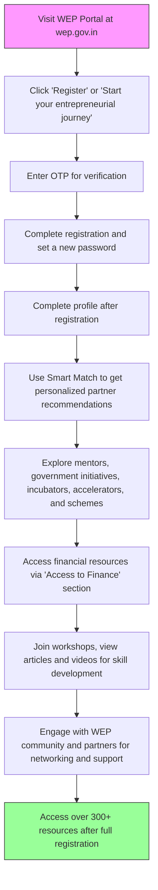

# Comprehensive Scheme Masterclass & File Guide

## Scheme Deep Dive

### Overview
The Women Entrepreneurship Platform (WEP) is a pioneering initiative by NITI Aayog designed to empower women entrepreneurs across India through a unified digital platform. It serves as a one-stop information hub connecting women entrepreneurs with government schemes, mentors, incubators, accelerators, financial resources, and peer networks. The platform operates on a rolling basis with no fixed deadlines, enabling continuous access to resources.

### Objectives
- Provide a unified platform for women entrepreneurs to access government schemes and resources  
- Connect women entrepreneurs with mentors, incubators, accelerators, and industry experts  
- Facilitate access to financial resources, grants, and schemes tailored for women-led businesses  
- Enable networking and peer support through the WEP community  
- Offer personalized guidance via Smart Match mentorship programs  
- Support skill development through workshops, videos, and knowledge resources  
- Promote financial inclusion and growth opportunities for women entrepreneurs  
- Showcase and recognize achievements of women entrepreneurs through awards and outreach programs  

### Eligibility Matrix
| Criteria | Details | Source |
|---------|---------|--------|
| Target Beneficiaries | Women entrepreneurs in India seeking to start, grow, or scale their ventures | Key Facts |
| Geographic Scope | Pan-India | Key Facts |
| Registration Requirement | OTP verification and profile completion required to access full resources | Key Facts |
| Pre-registration Access | 2 free pre-registration resources available before requiring full registration | Key Facts, Crawled Pages |
| Specific Eligibility | No specific eligibility criteria mentioned for platform access | Key Facts |
| Membership Status | Access to certain partner offers and discounts may require active WEP membership | Key Facts |

### Benefits & Financial Support
WEP does not directly provide financial support but facilitates access to financial resources through its 'Access to Finance' section, which curates funding opportunities from government initiatives, financial institutions, and partner organizations.

| Benefit Category | Details | Quantified Metrics | Source |
|------------------|---------|-------------------|--------|
| Resource Access | Access to over 300+ resources including government schemes, mentorship, initiatives, incubators, and networking | 300+ resources, 944+ mentors, 835+ government initiatives, 576+ incubators & accelerators, 112,832+ WEP family members, 51+ partners | Key Facts, Crawled Pages |
| Mentorship | Personalized guidance via Smart Match mentorship programs | 944+ experts available for mentorship | Key Facts |
| Financial Inclusion | Access to financial resources, grants, and schemes tailored for women-led businesses | Curated funding opportunities from government initiatives, financial institutions, and partner organizations | Key Facts |
| Skill Development | Skill development through articles, videos, workshop participation | Articles, videos, workshops available via knowledge portal | Key Facts, Crawled Pages |
| Recognition | Recognition through WEP awards and outreach programs | WEP flagship initiatives like Award-to-Reward (ATR) programmes | Key Facts, Newsletter |
| Networking | Networking with WEP community and partners | 112,832+ WEP family members, 51+ partners | Key Facts |
| Smart Match | Personalized partner recommendations via Smart Match | AI-driven personalized recommendations | Key Facts, Crawled Pages |
| Awards & Outreach | Recognition through WEP awards and outreach programs | WEP-उ��त (Unnati) programme awarded INR 5,00,000 eRUPI vouchers to winners | Newsletter |
| State Chapters | WEP State chapters launched to reach more women across India | First chapter launched in Telangana with WE Hub as nodal organisation | Newsletter |
| Unified Portal | Consolidates 835 government schemes for seamless information and access | Unified Portal inaugurated by Shri B.V.R. Subrahmanyam | Newsletter |
| Financial Literacy | Credit education program in partnership with TransUnion CIBIL and MSC | Provides essential financial literacy resources and business skills | From Borrowers to Builders Report |
| Credit Monitoring | Support for women to self-monitor credit health | 27 million women borrowers monitored credit with CIBIL as of Dec 2024 | From Borrowers to Builders Report |

### Application Process
The application process for WEP is straightforward and entirely digital, focused on registration and profile completion to unlock platform resources.

> **Important Notes on Application Process:**
> - Only 2 free pre-registration resources are available before requiring full registration
> - Some resources and services may have validity periods or expiry dates (e.g., discounts, offers)
> - Access to certain partner offers and discounts may require active WEP membership
> - The platform aggregates third-party schemes; eligibility and terms are governed by the respective implementing agencies
> - Application portal: https://wep.gov.in/register?page=register
> - Status: Rolling basis (no fixed deadlines)
> - Last Updated: 2024

### Key Caveats
> **Platform Limitations:** WEP does not directly provide financial support but facilitates access to financial resources. Eligibility and terms for financial schemes accessed through WEP are governed by the respective implementing agencies, not WEP itself.
> 
> **Resource Validity:** Some resources and services may have validity periods or expiry dates (e.g., discounts, offers). Users should verify current validity before relying on time-sensitive benefits.
> 
> **Membership Requirements:** Access to certain partner offers and discounts may require active WEP membership status.
> 
> **Third-Party Aggregation:** As an aggregator of third-party schemes, WEP provides access but does not guarantee eligibility or approve applications for external schemes.

### Supporting Evidence Summary
- **Portal Access:** Registration requires OTP verification and profile completion (multiple crawled pages)
- **Resource Volume:** Platform hosts 944+ mentors, 835+ government initiatives, 576+ incubators & accelerators, 112,832+ WEP family members (Key Facts)
- **Financial Access:** 'Access to Finance' section curates funding opportunities from government initiatives, financial institutions, and partner organizations (Key Facts)
- **State Chapters:** WEP Telangana Chapter launched with WE Hub as nodal organisation (Newsletter)
- **Unified Portal:** Consolidates 835 government schemes for seamless access (Newsletter)
- **Financial Literacy Partnership:** Collaboration with TransUnion CIBIL and MicroSave Consulting on credit education program (From Borrowers to Builders Report)
- **Credit Monitoring Growth:** 27 million women borrowers monitored credit with CIBIL as of Dec 2024, representing 42% increase from 2023 (From Borrowers to Builders Report)
- **Award Recognition:** WEP-उ��त (Unnati) programme awarded INR 5,00,000 eRUPI vouchers to winners (Newsletter)
- **Steering Committee:** 3rd Steering Committee meeting held on 28th August 2024, co-chaired by NITI Aayog CEO and Apollo Hospitals JMD (Newsletter)

## Consultant's Field Guide to Generated Files

### 1. SCHEME_MASTER_DATABASE.md
**Real-time Usage:** Keep this open in a background tab during all client calls. When a client asks "What is the turnover limit?" or "Who administers this?", CTRL+F in this document to give an immediate, authoritative answer without checking the portal.

### 2. PITCH_AND_SALES_SCRIPTS.md
**Real-time Usage:** Open this file 5 minutes before your first Discovery Call with a lead. Read the "Problem Framing" out loud to hook them, then use the Qualification Checklist to interrogate their eligibility live on the phone. Keep the Objection Handlers table visible so you can immediately counter when they say "We're too small for this."

### 3. APPLICATION_PLAYBOOK.md
**Real-time Usage:** Print this out or pin it to your desktop once the client signs the retainer. Check off each box in "Stage 1" before moving to "Stage 2". Use the "Client Communication Template" to copy-paste directly into your email when chasing them for pending documents.

### 4. CLIENT_ONBOARDING_AND_CRM.md
**Real-time Usage:** Fill this out during or immediately after the onboarding call. Use the Needs Assessment to record their exact pain points. Update the "Compliance Status" table as they email you documents to maintain a single source of truth for what's missing.

### 5. LIVE_CASE_TRACKER.md
**Real-time Usage:** Review this document every morning during your standup. Update the "Stage" column daily. If a case hits "Stage 07 - Under review", use the Escalation Path notes here to know exactly who to call at the government department today.

### 6. FEE_AND_REVENUE_MODEL.md
**Real-time Usage:** Use this file when drafting the proposal. Look at the client's turnover, map them to the pricing tier in the table, and quote that exact Retainer and Success Fee. Use the monthly projection table to update your personal sales pipeline forecast for the quarter.

### 7. CLIENT_PROPOSAL_TEMPLATE.md
** Look at the client's turnover, map them to the pricing tier in the table, and quote that exact Retainer and Success Fee. Use the monthly projection table to update your personal sales pipeline forecast for the quarter.

### 7. CLIENT_PROPOSAL_TEMPLATE.md
**Real-time Usage:** Copy this entire file, paste it into an email or PDF generator, replace the [PLACEHOLDER] tags with the client's actual details gathered from the CRM, and send it immediately after a successful discovery call.

### 8. COMPLIANCE_AND_LEGAL_PACK.md
**Real-time Usage:** Attach sections 8A and 8B as PDFs to the proposal email. Refuse to start Step 1 of the Application Playbook until the client signs these. Use the Disclaimers to protect yourself legally if the client is rejected by the government agency.