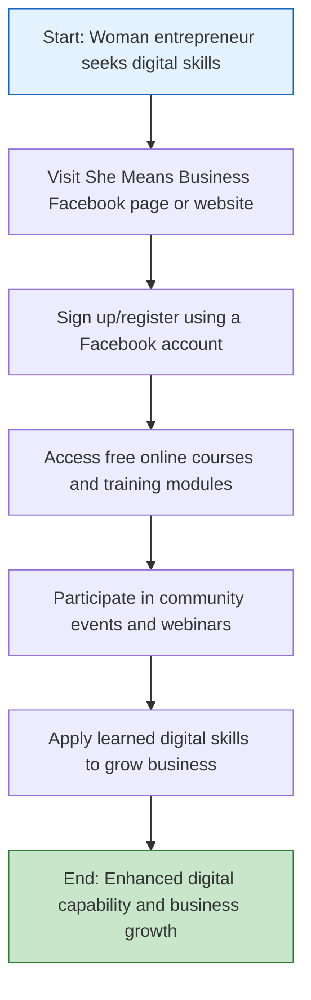

</think># Comprehensive Scheme Masterclass & File Guide

## Scheme Deep Dive

### Overview
**She Means Business – Digital Skills for Women** is a pan-India initiative implemented by Meta (Facebook) aimed at empowering women entrepreneurs through digital capacity building. The program operates on a rolling basis with no fixed deadline, offering year-round access to training and resources via Meta’s platforms. It does not provide direct financial support but focuses on skill development, mentorship, and community engagement to foster inclusive economic participation.

**Application Portal:** [https://www.facebook.com/business/m/she-means-business](https://www.facebook.com/business/m/she-means-business)

### Objectives
- Empower women entrepreneurs with digital skills  
- Support women in starting and growing their businesses  
- Provide access to mentorship and peer networks  
- Enable use of digital tools for business growth  
- Foster inclusive economic participation of women  

### Eligibility Matrix
| Criteria | Details |
|--------|--------|
| **Target Beneficiaries** | Women entrepreneurs, aspiring business owners, and women-led small businesses |
| **Geographic Scope** | Pan-India |
| **Primary Requirement** | Seeking to enhance digital capabilities and grow ventures through online platforms |
| **Access Requirement** | Must have internet access and a Facebook/Meta account to participate |
| **Exclusions** | None specified beyond gender and intent; open to all stages of business journey |

### Benefits & Financial Support
| Benefit Type | Details |
|-------------|--------|
| **Financial Support** | ❌ No direct financial support, grants, loans, or subsidies provided |
| **Training & Learning** | ✅ Free digital skills training; access to online learning modules |
| **Mentorship & Networking** | ✅ Mentorship opportunities; community networking; participation in webinars and community events |
| **Business Tools** | ✅ Tools for business promotion on Meta platforms; guidance on leveraging social media for growth |
| **Outcome Focus** | ✅ Application of learned digital skills to grow business |

> **Key Caveats**  
> - Program is delivered primarily through Facebook and Meta platforms  
> - No financial assistance or funding is provided  
> - Requires access to internet and a Facebook/Meta account to participate  
> - Status: Rolling basis — no fixed deadline. Registration and learning are open year-round.

### Application Process Flowchart

---

## Consultant's Field Guide to Generated Files

### 1. SCHEME_MASTER_DATABASE.md
**Real-time Usage:** Keep this open in a background tab during all client calls. When a client asks "What is the turnover limit?" or "Who administers this?", CTRL+F in this document to give an immediate, authoritative answer without checking the portal.

### 2. PITCH_AND_SALES_SCRIPTS.md
**Real-time Usage:** Open this file 5 minutes before your first Discovery Call with a lead. Read the "Problem Framing" out loud to hook them, then use the Qualification Checklist to interrogate their eligibility live on the phone. Keep the Objection Handlers table visible so you can immediately counter when they say "We're too small for this."

### 3. APPLICATION_PLAYBOOK.md
**Real-time Usage:** Print this out or pin it to your desktop once the client signs the retainer. Check off each box in "Stage 1" before moving to "Stage 2". Use the "Client Communication Template" to copy-paste directly into your email when chasing them for pending documents.

### 4. CLIENT_ONBOARDING_AND_CRM.md
**Real-time Usage:** Fill this out during or immediately after the onboarding call. Use the Needs Assessment to record their exact pain points. Update the "Compliance Status" table as they email you documents to maintain a single source of truth for what's missing.

### 5. LIVE_CASE_TRACKER.md
**Real-time Usage:** Review this document every morning during your standup. Update the "Stage" column daily. If a case hits "Stage 07 - Under review", use the Escalation Path notes here to know exactly who to call at the government department today.

### 6. FEE_AND_REVENUE_MODEL.md
**Real-time Usage:** Use this file when drafting the proposal. Look at the client's turnover, map them to the pricing tier in the table, and quote that exact Retainer and Success Fee. Use the monthly projection table to update your personal sales pipeline forecast for the quarter.

### 7. CLIENT_PROPOSAL_TEMPLATE.md
**Real-time Usage:** Copy this entire file, paste it into an email or PDF generator, replace the [PLACEHOLDER] tags with the client's actual details gathered from the CRM, and send it immediately after a successful discovery call.

### 8. COMPLIANCE_AND_LEGAL_PACK.md
**Real-time Usage:** Attach sections 8A and 8B as PDFs to the proposal email. Refuse to start Step 1 of the Application Playbook until the client signs these. Use the Disclaimers to protect yourself legally if the client is rejected by the government agency.