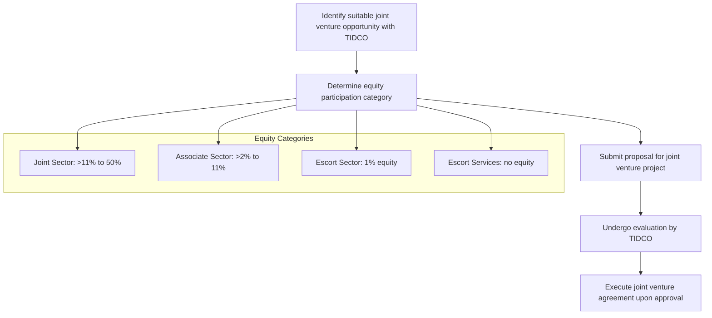

# Comprehensive Scheme Masterclass & File Guide

## Scheme Deep Dive

### Scheme Overview
**Scheme Name:** TIDCO – Tamil Nadu Industrial Dev. Corp Schemes  
**Scheme ID:** row-340  
**Ministry / Category:** State Level (Tamil Nadu)  
**Scheme Type:** other  
**Geographic Scope:** Tamil Nadu only  
**Implementing Agency:** Tamil Nadu Industrial Development Corporation Limited (TIDCO)  
**Status / Deadlines:** Rolling basis  
**Contact Details:** Phone: +91 44 28554479, 28554480 | Email: info@tidco.com  
**Application Portal URL:** https://tidco.com  

### Objectives
- Achieve balanced and continual industrial growth in Tamil Nadu  
- Promote medium and large industries through joint ventures  
- Serve as nodal agency for industrial corridor projects  
- Facilitate investment in large industrial and infrastructure projects  
- Promote four types of joint ventures: Joint Sector, Associate Sector, Escort Sector, and Escort Services  

### Eligibility Matrix
| Eligibility Category | Equity Participation Range | Description |
|----------------------|----------------------------|-------------|
| Joint Sector | Above 11% to 50% | Equity participation above 11% and up to 50% |
| Associate Sector | Above 2% to 11% | Equity participation above 2% and up to 11% |
| Escort Sector | 1% equity | 1% equity participation |
| Escort Services | No equity participation | No equity participation |

**Target Beneficiaries:** Medium and large industries; joint venture partners; infrastructure developers  

### Benefits & Financial Support
| Benefit Category | Details |
|------------------|---------|
| Financial Support | TIDCO promotes joint ventures with equity participation ranging from 1% to 50% depending on the sector type. Financial support is structured through equity participation in joint venture projects, with TIDCO acting as a nodal agency for industrial corridor projects and facilitating large-scale investments. |
| Network Access | Access to TIDCO's network of joint venture projects across sectors including Chemicals, Fertilizers, Pharmaceuticals, Textiles, Iron and Steel, Auto Components, Food & Agro, Floriculture, Engineering, Petroleum and Petrochemicals, infrastructure projects like IT/ITES Parks, Bio-Tech Parks, SEZs, Road Development Projects, and Agri Export Zones. |
| Investment Facilitation | TIDCO facilitates investment in large industrial and infrastructure projects in Tamil Nadu and promotes balanced industrial growth. |
| Successful Joint Ventures | TIDCO has successful joint ventures with: TITAN Industries Ltd, TANFAC Industries Ltd, Mahindra World City, Tamilnadu Petro products Ltd, TIDEL Park Ltd, Ascendas IT Park (Chennai) Ltd, TICEL Bio Park Ltd, Tamilnadu Road Development Company Ltd, Chennai Trade Centre, Tanflora Infrastructure Park Ltd, IT Expressway Ltd, TIDEL Park Coimbatore Ltd, L&T Shipbuilding Ltd and Indian Oil LNG Private Ltd. |

### Application Process

**Key Caveats:**
- Joint sector requires equity participation above 11% and up to 50%
- Associate sector requires equity participation above 2% and up to 11%
- Escort sector requires 1% equity participation
- Escort services involve no equity participation

---

## Consultant's Field Guide to Generated Files

### 1. SCHEME_MASTER_DATABASE.md
**Real-time Usage:** Keep this open in a background tab during all client calls. When a client asks "What is the turnover limit?" or "Who administers this?", CTRL+F in this document to give an immediate, authoritative answer without checking the portal.

### 2. PITCH_AND_SALES_SCRIPTS.md
**Real-time Usage:** Open this file 5 minutes before your first Discovery Call with a lead. Read the "Problem Framing" out loud to hook them, then use the Qualification Checklist to interrogate their eligibility live on the phone. Keep the Objection Handlers table visible so you can immediately counter when they say "We're too small for this."

### 3. APPLICATION_PLAYBOOK.md
**Real-time Usage:** Print this out or pin it to your desktop once the client signs the retainer. Check off each box in "Stage 1" before moving to "Stage 2". Use the "Client Communication Template" to copy-paste directly into your email when chasing them for pending documents.

### 4. CLIENT_ONBOARDING_AND_CRM.md
**Real-time Usage:** Fill this out during or immediately after the onboarding call. Use the Needs Assessment to record their exact pain points. Update the "Compliance Status" table as they email you documents to maintain a single source of truth for what's missing.

### 5. LIVE_CASE_TRACKER.md
**Real-time Usage:** Review this document every morning during your standup. Update the "Stage" column daily. If a case hits "Stage 07 - Under review", use the Escalation Path notes here to know exactly who to call at the government department today.

### 6. FEE_AND_REVENUE_MODEL.md
**Real-time Usage:** Use this file when drafting the proposal. Look at the client's turnover, map them to the pricing tier in the table, and quote that exact Retainer and Success Fee. Use the monthly projection table to update your personal sales pipeline forecast for the quarter.

### 7. CLIENT_PROPOSAL_TEMPLATE.md
**Real-time Usage:** Copy this entire file, paste it into an email or PDF generator, replace the [PLACEHOLDER] tags with the client's actual details gathered from the CRM, and send it immediately after a successful discovery call.

### 8. COMPLIANCE_AND_LEGAL_PACK.md
**Real-time Usage:** Attach sections 8A and 8B as PDFs to the proposal email. Refuse to start Step 1 of the Application Playbook until the client signs these. Use the Disclaimers to protect yourself legally if the client is rejected by the government agency.