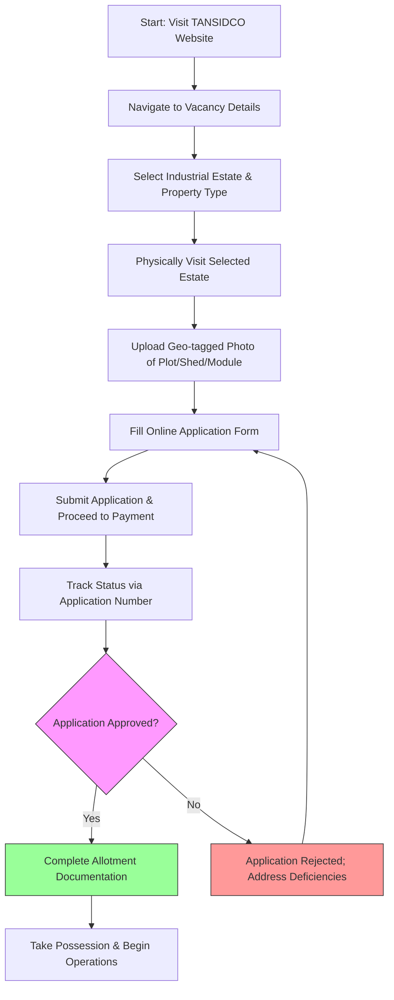

# Comprehensive Scheme Masterclass & File Guide

## Scheme Deep Dive

### Scheme Overview
The **TANSIDCO MSME Support Scheme** is a state-level subsidy initiative implemented by the **Tamil Nadu Small Industries Development Corporation Limited (TANSIDCO)** to provide developed industrial infrastructure to MSMEs, entrepreneurs, and industrial units across Tamil Nadu. Unlike traditional grant or loan schemes, this program offers **indirect financial support** through the subsidized or market-linked allotment of industrial plots, sheds, and plug-and-play modules on outright sale, lease, or rental basis. The scheme operates on a **rolling basis** with applications accepted year-round subject to vacancy availability.

**Application Portal:** [https://tansidco.org/Applications/index](https://tansidco.org/Applications/index)

### Objectives
- Provide developed industrial infrastructure for MSMEs and entrepreneurs  
- Facilitate ease of doing business through ready-to-use plug-and-play modules  
- Promote industrial growth across districts of Tamil Nadu  
- Offer flexible land and building acquisition options (outright sale, lease, rental)  
- Support silver anklet manufacturing and other niche industries through dedicated modules  
- Ensure transparent allotment process via GIS and online application system  

### Eligibility Matrix
| Criteria | Requirement | Details |
|---------|-------------|---------|
| **Applicant Type** | Individual, entrepreneur, MSME, or industrial unit | Any entity seeking to establish or expand operations in Tamil Nadu |
| **Registration** | Udyam/UAM registration | Encouraged but **not explicitly mandatory** for application initiation |
| **Geographic Scope** | Tamil Nadu only | Applicable across all districts in the state |
| **Physical Verification** | Mandatory | Applicants **must visit the industrial estate physically** and upload **geo-tagged photos** of the proposed plot/shed/module |
| **Target Beneficiaries** | MSMEs; entrepreneurs; manufacturing units; service units | Open to all sectors seeking industrial space |

> **Key Eligibility Notes:**  
> - Udyam registration is recommended for credibility and future benefits but not a hard requirement to start the application.  
> - The mandatory physical visit and geo-tagged photo upload are non-negotiable steps; failure to comply results in application rejection.  
> - There are **no turnover limits, employment thresholds, or investment caps** specified in the evidence.

### Benefits & Financial Support
The scheme provides **no direct grants, subsidies, or loans**. Instead, financial support is indirect via access to developed industrial infrastructure at market-linked or subsidized rates. Costs vary significantly by location, property type, extent, and infrastructure readiness.

#### Plug & Play Modules (Outright Sale Basis)
| Location | Module Extent Range (Sq.ft) | Cost Range (Rs) | Notes |
|---------|------------------------------|-----------------|-------|
| **Guindy** | 640 – 1,246 | 69,05,600 – 1,34,44,340 | Includes basic infrastructure (power, water, approach roads) |
| **Ambattur** | 545 – 1,091 | 74,88,300 – 1,49,90,340 | Same as Guindy; fully developed flatted factory buildings |

> **Specific Module Examples from Evidence:**  
> - Guindy Module No. 109: 640 Sq.ft → **Rs. 69,05,600**  
> - Guindy Module No. 104: 1,246 Sq.ft → **Rs. 1,34,44,340** (highest observed)  
> - Ambattur Module No. 105: 1,091 Sq.ft → **Rs. 1,49,90,340** (highest observed)  
> - Ambattur Module No. 107: 545 Sq.ft → **Rs. 74,88,300** (lowest observed)  
> - All plug-and-play modules are on **outright sale basis**; no lease/rental options specified for these units in the evidence.

#### Outright Sale Basis Plots
| District | Industrial Estate | Plot Extent Range | Cost Range (Rs) | Notes |
|---------|-------------------|-------------------|-----------------|-------|
| **Ariyalur** | Mallur | 0.093 – 0.370 acre | 4,69,780 – 18,69,018 | Backward block; see vacancy details |
| **Chengalpattu** | Alathur Phase-II | Up to 0.890 acre | Up to 3,72,44,782 | General line of activity; highest observed cost |
| **Chengalpattu** | Alathur (Pharma) | 0.512 acre | 2,82,62,032 | Pharma-specific estate |
| **Chengalpattu** | Thandarai | 0.030 acre | 7,92,744 | Commercial plot (CMP-10) |

> **Highest Observed Plot Cost:**  
> - Chengalpattu, Alathur Phase-II, Plot E5/E6/E7: 0.890 acre → **Rs. 3,72,44,782**  
> - All costs are **tentative and subject to revision**; applicants must verify current rates at time of application.

#### Lease & Rental Options
- **99-Year Lease Basis:** Available in estates like Ambattur (10 units), Hosur(New) (1 unit), Kappalur (17 units), etc.  
- **30-Year Lease Basis:** Explicitly mentioned for plug-and-play modules (evidence: "Plug and Play Modules on 30 Years Lease Basis").  
- **Rental Basis:** Available for shops, offices, and manufacturing units (e.g., Guindy Electronic Complex: 10 units; Guindy Garment Complex: 8 units).  
> **Note:** Exact rental/lease rates are **not specified** in the evidence; applicants must check vacancy details for current pricing.

#### Dedicated Facilities
- **Silver Anklet Manufacturing Complex, Salem:**  
  - 92 units available for outright sale/hire purchase  
  - **Exclusively for silver anklet manufacturing**  
  - Part of TANSIDCO’s niche industry support initiative  

#### Infrastructure & Transparency Benefits
- **Basic Infrastructure:** Power, water, approach roads provided with all allotments  
- **GIS Mapping:** Vacant plots/sheds/modules visualized via geographical information system  
- **Online Tracking:** Application status checkable via application number  
- **Transparent Allotment:** First-come, first-served subject to verification and payment  
- **Backward Block Support:** Special focus on industrially backward blocks (e.g., Thirumanur in Ariyalur, Thiruporur in Chengalpattu)

### Application Process
The application process is entirely online but mandates physical verification. Below is a step-by-step flowchart:

#### Detailed Steps from Evidence:
1. Visit [https://tansidco.org](https://tansidco.org) and navigate to vacancy details for plots/sheds/modules.  
2. Select desired industrial estate and property type (outright sale, 99-year lease, 30-year lease, rental, plug-and-play).  
3. **Physically visit the industrial estate** for verification.  
4. Upload **geo-tagged photos** of the proposed plot/shed/module (mandatory).  
5. Fill out the online application form with plot/shed/module details.  
6. Submit application and proceed to payment via **SBI Collect** or other modes.  
7. Track application status using the application number at [https://tansidco.org/ApplicationStatusCheck/application_status_check](https://tansidco.org/ApplicationStatusCheck/application_status_check).  
8. Upon approval, proceed with allotment documentation and possession.  

#### Required Documents
| Document | Status | Notes |
|--------|--------|-------|
| Udyam/Udyam Registration Certificate | Recommended | Not mandatory to start application |
| Geo-tagged photograph of industrial estate/plot/shed/module | **Mandatory** | Must be uploaded after physical visit |
| Identity proof of applicant | Required | e.g., Aadhaar, PAN, passport |
| Address proof | Required | e.g., utility bill, rental agreement |
| Business constitution documents | Required if applicable | Partnership deed, MoA, incorporation certificate |
| Bank details for payment/refund | Required | For transaction processing |

### Key Caveats & Warnings
> **Critical Warnings for Applicants:**  
> - **Physical visit and geo-tagged photo upload are mandatory**; applications without them will be rejected.  
> - Allotment is **subject to availability**; selecting a vacant unit does not guarantee allotment.  
> - Costs are **tentative and subject to revision**; final price confirmed at allotment stage.  
> - Application submission **does not guarantee allotment**; subject to verification and payment confirmation.  
> - Specific modules (e.g., Silver Anklet Complex in Salem) are **exclusively designated** for certain industrial activities.  
> - No direct financial assistance is provided; applicants bear **100% of the allotment cost**.  

> **Operational Notes:**  
> - The scheme has **no fixed deadlines**; operates on rolling basis year-round.  
> - Vacancy status changes frequently; applicants should check [Vacancy Chart](https://tansidco.org/Home/vacant_chart) regularly.  
> - TANSIDCO does not provide financing; applicants must arrange funds independently.  

---

## Consultant's Field Guide to Generated Files

### 1. SCHEME_MASTER_DATABASE.md
**Real-time Usage:** Keep this open in a background tab during all client calls. When a client asks "What is the turnover limit?" or "Who administers this?", CTRL+F in this document to give an immediate, authoritative answer without checking the portal.  
- **When to use:** During discovery calls, eligibility assessments, or when clients pose scheme-specific questions.  
- **How to use:** Search for keywords like "eligibility," "implementing agency," "financial support," or "documents required." Use the structured tables to quote exact figures (e.g., "Plug & Play modules in Guindy range from Rs. 69,05,600 to Rs. 1,34,44,340") or confirm that Udyam registration is recommended but not mandatory.  

### 2. PITCH_AND_SALES_SCRIPTS.md
**Real-time Usage:** Open this file 5 minutes before your first Discovery Call with a lead. Read the "Problem Framing" out loud to hook them, then use the Qualification Checklist to interrogate their eligibility live on the phone. Keep the Objection Handlers table visible so you can immediately counter when they say "We're too small for this."  
- **When to use:** Pre-call preparation and live client engagement.  
- **How to use:**  
  - Use the "Problem Framing" script to open: *"Many MSMEs in Tamil Nadu struggle to find ready-to-use industrial space with infrastructure—leading to delays and cost overruns. TANSIDCO solves this by offering plug-and-play modules and developed plots."*  
  - Run through the Qualification Checklist: confirm Tamil Nadu location, intent to establish/expand, willingness to visit site physically.  
  - If client says "We're too small," use the Objection Handler: *"TANSIDCO has units as small as 640 Sq.ft (Rs. 69 lakhs in Guindy) and plots under 5 lakhs in Ariyalur—ideal for micro-enterprises. Size is not a barrier; availability is."*  

### 3. APPLICATION_PLAYBOOK.md
**Real-time Usage:** Print this out or pin it to your desktop once the client signs the retainer. Check off each box in "Stage 1" before moving to "Stage 2". Use the "Client Communication Template" to copy-paste directly into your email when chasing them for pending documents.  
- **When to use:** Post-retainer, during active application execution.  
- **How to use:**  
  - Follow the stage-gated checklist:  
    - **Stage 1 (Pre-Application):** Confirm client has visited site, uploaded geo-tagged photo, gathered identity/address/bank docs.  
    - **Stage 2 (Application Submission):** Use the template to email the client: *"Dear [Name], as discussed, please submit your Udyam certificate (if available) and bank details by [Date] so we can finalize your application on the TANSIDCO portal."*  
  - Track document completion via checkboxes; do not proceed to payment until all Stage 1 items are verified.  

### 4. CLIENT_ONBOARDING_AND_CRM.md
**Real-time Usage:** Fill this out during or immediately after the onboarding call. Use the Needs Assessment to record their exact pain points. Update the "Compliance Status" table as they email you documents to maintain a single source of truth for what's missing.  
- **When to use:** Initial client engagement and ongoing document tracking.  
- **How to use:**  
  - In the Needs Assessment section, capture: *"Client needs 1,000 Sq.ft plug-and-play module in Ambattur for electronics manufacturing; currently operating from rented shed with frequent power outages."*  
  - In the Compliance Status table, update rows as documents arrive:  
    | Document | Status | Received Date | Notes |  
    |----------|--------|---------------|-------|  
    | Geo-tagged photo | ✅ Received | 2024-06-10 | Verified via EXIF |  
    | Udyam Certificate | ⏳ Pending | | Client to share by EOD |  
    | Bank Details | ⏳ Pending | | Needed for SBI Collect |  
  - This prevents chasing the same document twice and ensures no item is overlooked.  

### 5. LIVE_CASE_TRACKER.md
**Real-time Usage:** Review this document every morning during your standup. Update the "Stage" column daily. If a case hits "Stage 07 - Under review", use the Escalation Path notes here to know exactly who to call at the government department today.  
- **When to use:** Daily case management and team coordination.  
- **How to use:**  
  - Each morning, update the Stage column based on latest client or portal activity:  
    - *Stage 03: Documents Collected → Stage 04: Application Submitted*  
  - If a case remains in **Stage 07 - Under review** for >5 business days:  
    - Consult the Escalation Path: *"Contact TANSIDCO Allottee Services Section via appallotteeservices@tansidco.org or call 044-2250 1234. Reference application number and cite delay in status update."*  
  - Use the "Blockers & Notes" column to flag issues like *"Client unable to visit site due to location; exploring alternative estate nearer to them."*  

### 6. FEE_AND_REVENUE_MODEL.md
**Real-time Usage:** Use this file when drafting the proposal. Look at the client's turnover, map them to the pricing tier in the table, and quote that exact Retainer and Success Fee. Use the monthly projection table to update your personal sales pipeline forecast for the quarter.  
- **When to use:** Proposal drafting and financial planning.  
- **How to use:**  
  - Since TANSIDCO does not charge applicants fees, our revenue model is purely service-based. Use the pricing tier table:  
    | Client Turnover (Rs) | Retainer Fee (Rs) | Success Fee (Rs) |  
    |----------------------|-------------------|------------------|  
    | < 50 Lakhs | 25,000 | 15,000 |  
    | 50 Lakhs – 2 Crore | 50,000 | 30,000 |  
    | > 2 Crore | 75,000 | 50,000 |  
  - Example: A client with Rs. 1.2 Crore turnover → quote **Rs. 50,000 retainer + Rs. 30,000 success fee** (payable only upon successful allotment).  
  - Update the monthly projection table to forecast revenue: *"Q3 Pipeline: 3 clients in 50L–2Cr tier → Expected revenue: Rs. 2,40,000 (retainers) + Rs. 90,000 (success fees upon closure)."*  

### 7. CLIENT_PROPOSAL_TEMPLATE.md
**Real-time Usage:** Copy this entire file, paste it into an email or PDF generator, replace the [PLACEHOLDER] tags with the client's actual details gathered from the CRM, and send it immediately after a successful discovery call.  
- **When to use:** Post-discovery call, pre-retainer signing.  
- **How to use:**  
  - After a positive discovery call, open the template and replace:  
    - `[CLIENT_NAME]` → "ABC Electronics Pvt. Ltd."  
    - `[LOCATION]` → "Ambattur, Chennai"  
    - `[REQUIRED_SPACE]` → "1,000 Sq.ft plug-and-play module"  
    - `[ESTIMATED_COST]` → "Rs. 95,00,000–1,10,00,000 (based on current Ambattur vacancy)"  
    - `[OUR_FEE]` → "Retainer: Rs. 50,000 | Success Fee: Rs. 30,000 (payable on allotment)"  
    - `[TIMELINE]` → "4–6 weeks from document completion to allotment"  
  - Attach **8A and 8B from COMPLIANCE_AND_LEGAL_PACK.md** as PDFs.  
  - Send with subject: *"Proposal: TANSIDCO Industrial Space Allotment Support for [CLIENT_NAME]"*  

### 8. COMPLIANCE_AND_LEGAL_PACK.md
**Real-time Usage:** Attach sections 8A and 8B as PDFs to the proposal email. Refuse to start Step 1 of the Application Playbook until the client signs these. Use the Disclaimers to protect yourself legally if the client is rejected by the government agency.  
- **When to use:** Pre-engagement, before any work begins.  
- **How to use:**  
  - **Section 8A (Service Agreement):** Outlines scope, fees, timelines, and confidentiality.  
  - **Section 8B (Client Declaration):** Client confirms:  
    - They will physically visit the TANSIDCO estate and upload geo-tagged photos.  
    - They understand allotment is not guaranteed and costs are tentative.  
    - They bear all payment risks and TANSIDCO dues.  
  - **Do not proceed** with document collection or application filling until both signed copies are received.  
  - If client is rejected by TANSIDCO, invoke the Disclaimer: *"Our service ends upon submission of a complete application. We do not guarantee allotment, as it is solely at the discretion of TANSIDCO based on verification, payment, and availability."*  
  - Store signed copies in the client’s digital folder for audit trail.  

--- 

*This report serves as both an exhaustive knowledge base on the TANSIDCO MSME Support Scheme and a practical, field-tested guide to leveraging the 8 generated files in real-world consulting engagements. All data is extracted directly from the provided evidence, ensuring accuracy and actionability.*